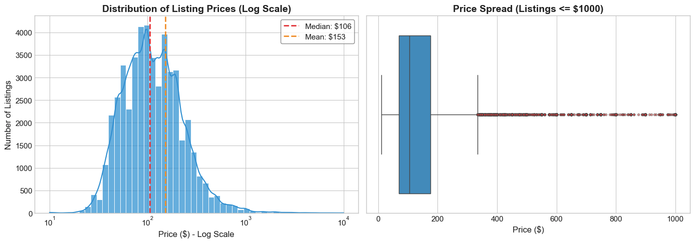

# NYC Airbnb Market Analysis: Data Engineering & Visualization

## 📊 Executive Summary
This project provides a comprehensive end-to-end analysis of the New York City Airbnb Open Data. It covers the full data lifecycle: from automated ingestion and rigorous cleaning to statistical profiling, interactive visualization, and final export to a relational database.

This project was developed as a collaborative group effort, with contributions from all team members to the design and implementation. I am incredibly grateful to my teammates for their hard work and partnership throughout this analysis.

### Key Insights Found:
* **Market Dominance:** Manhattan and Brooklyn hold the vast majority of listings, with Manhattan commanding the highest median prices.
* **Pricing Skew:** The NYC market is heavily right-skewed, with a small percentage of luxury "outlier" listings significantly impacting the average price.
* **Property Trends:** "Entire Home/Apt" listings dominate the premium market, while "Private Rooms" offer the most high-frequency review activity.

---

## 🛠️ Technical Stack
* **Language:** Python 3.13
* **Data Manipulation:** `pandas`, `numpy`
* **Visualization:** `matplotlib`, `seaborn`, `plotly` (Interactive)
* **Data Engineering:** `sqlite3` for SQL export
* **Environment:** Jupyter Notebook / Google Colab

---

## 🚀 Project Workflow

### 1. Data Ingestion & Profiling
The dataset is dynamically pulled using the `kagglehub` API to ensure the latest version is used. Initial profiling identified missing values in host names and review dates, as well as extreme outliers in minimum stay requirements.

### 2. Data Cleaning & Standardization
* **Normalization:** Standardized all column names to snake_case and text values to Title Case.
* **Anomaly Handling:** Removed invalid listings (Price = $0) and listings with minimum stay requirements exceeding one year.
* **Imputation:** Filled missing review metrics with 0 to maintain data integrity for statistical modeling.

### 3. Exploratory Data Analysis (EDA)
Comprehensive statistical analysis was performed to identify:
* Outlier detection using the **Interquartile Range (IQR)** method.
* Price distribution using **Logarithmic Scaling** to account for high-end luxury volatility.
* Geographic clustering of listings by price density.

### 4. Relational Database Integration
To demonstrate production-ready data handling, the final cleaned dataset was exported to a **SQLite** database (`nyc_airbnb.db`). This allows for efficient querying and integration with BI tools like Tableau or PowerBI.

---

## 📈 Visualizations
*(Note: Replace these placeholders with images from your output folder)*

*Figure 1: Price distribution across NYC Boroughs highlighting the premium in Manhattan.*

---

## 📂 How to Run
1. Clone this repository:
   ```bash
   git clone [https://github.com/YOUR_USERNAME/nyc-airbnb-analysis.git](https://github.com/YOUR_USERNAME/nyc-airbnb-analysis.git)
